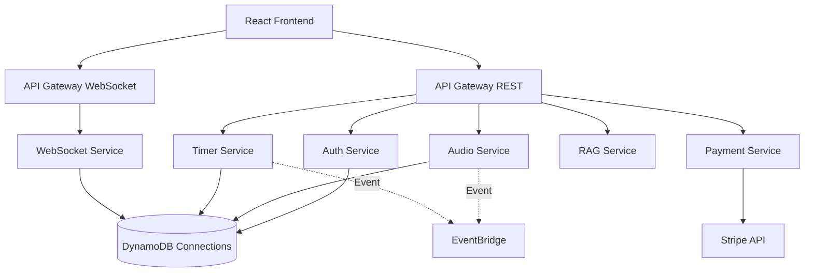

# Electromagnetic Beat Lab - Microservices Migration Plan

## 🎯 Migration Overview

**Goal**: Migrate monolithic FastAPI backend to AWS Lambda microservices architecture

**Current State**: Single FastAPI application handling all functionality
**Target State**: 6 independent microservices deployed as AWS Lambda functions

**Organization**: nngc333 (Serverless Framework)

---

## 📊 Current Monolithic Architecture

### Main Application (`backend/main.py`)
- **Lines**: 407 lines
- **Routes**: WebSocket, HTTP endpoints
- **Dependencies**: AudioEngine, FieldSimulator, BinauralBeatGenerator, SpatialAudioProcessor
- **Database**: SQLite (dev) / PostgreSQL (planned)
- **Real-time**: WebSocket connections with ConnectionManager

### Service Modules
```
backend/
├── services/
│   ├── simple_auth.py       # OAuth, JWT authentication
│   ├── stripe_service.py    # Payment processing
│   ├── timer_service.py     # Session timing
│   └── user_service.py      # User management
├── routes/
│   ├── audio_websocket.py   # Real-time audio streaming
│   ├── timer.py             # Timer endpoints
│   ├── rag_routes.py        # Code intelligence
│   └── simple_routes.py     # Basic CRUD operations
├── core/
│   ├── audio_engine.py      # Audio generation core
│   ├── field_simulator.py   # EM field simulation
│   └── frame_buffer.py      # Frame buffering
├── modules/
│   ├── binaural.py          # Binaural beat generation
│   └── spatial_audio.py     # 8D audio processing
└── protocols/
    └── adhd_protocols.py    # ADHD treatment protocols
```

### Key Challenges
1. **Stateful WebSocket connections** - Lambda timeout limitations
2. **Shared in-memory state** - ConnectionManager, AudioEngine sessions
3. **Heavy audio processing** - NumPy/SciPy operations
4. **Cross-cutting concerns** - Auth, logging, metrics

---

## 🏗️ Target Microservices Architecture

### Service Boundaries



---

## 🎤 Microservice Definitions

### 1. Auth Service (λ auth)
**Purpose**: User authentication, authorization, JWT management

**Endpoints**:
- `POST /auth/login` - OAuth login (Google, Facebook, GitHub)
- `POST /auth/refresh` - Refresh JWT tokens
- `POST /auth/logout` - Invalidate tokens
- `GET /auth/me` - Get current user profile
- `POST /auth/register` - Register new user

**Database**: DynamoDB `Users` table

**Dependencies**:
- OAuth providers (Google, Facebook, GitHub)
- JWT token generation/validation
- Stripe customer creation (on registration)

**Handler**: `backend/lambda_handlers.auth_handler`

**Environment Variables**:
```bash
GOOGLE_CLIENT_ID
FACEBOOK_APP_ID
GITHUB_CLIENT_ID
JWT_SECRET
STRIPE_SECRET_KEY
```

---

### 2. Audio Service (λ audioEngine)
**Purpose**: Audio generation, binaural beats, spatial processing

**Endpoints**:
- `POST /audio/generate` - Generate audio frame
- `POST /audio/configure` - Update audio settings
- `GET /audio/protocols` - List ADHD protocols
- `GET /audio/presets` - List binaural beat presets
- `GET /audio/spatial` - Get spatial audio options

**Processing**:
- Binaural beat generation (NumPy/SciPy)
- 8D spatial audio processing
- EM field simulation
- ADHD protocol application

**Handler**: `backend/lambda_handlers.audio_handler`

**Optimization**:
- Pre-warmed Lambda containers
- Provisioned concurrency for low latency
- Lambda layers for NumPy/SciPy

**State Management**: DynamoDB `AudioSessions` table

---

### 3. WebSocket Service (λ websocket)
**Purpose**: Real-time bi-directional communication

**Routes**:
- `$connect` - Handle new WebSocket connections
- `$disconnect` - Clean up disconnections
- `$default` - Handle all WebSocket messages

**Message Types**:
```json
{
  "start_stream": "Initialize audio/field streaming",
  "update_settings": "Real-time parameter updates",
  "stop_stream": "Terminate streaming"
}
```

**Handlers**:
- `backend/lambda_handlers.websocket_connect`
- `backend/lambda_handlers.websocket_disconnect`
- `backend/lambda_handlers.websocket_default`

**Database**: DynamoDB `Connections` table

**Challenges**:
- Lambda 15-minute timeout vs long-lived WebSocket sessions
- Solution: Use API Gateway WebSocket + EventBridge for long-running streams

---

### 4. Timer Service (λ timer)
**Purpose**: Session timing, scheduling, countdown management

**Endpoints**:
- `POST /timer/start` - Start new timer session
- `POST /timer/pause` - Pause active timer
- `POST /timer/resume` - Resume paused timer
- `POST /timer/stop` - Stop timer
- `GET /timer/{session_id}` - Get timer status

**Handler**: `backend/lambda_handlers.timer_handler`

**Database**: DynamoDB `TimerSessions` table

**Integration**: Publishes events to EventBridge on timer completion

---

### 5. Payment Service (λ payment)
**Purpose**: Stripe integration, subscription management

**Endpoints**:
- `POST /payment/create-checkout` - Create Stripe checkout session
- `POST /payment/webhook` - Handle Stripe webhooks
- `GET /payment/subscription/{user_id}` - Get subscription status
- `POST /payment/cancel` - Cancel subscription

**Handler**: `backend/lambda_handlers.payment_handler`

**External Integration**: Stripe Payment API

**Database**: DynamoDB `Subscriptions` table

---

### 6. RAG Service (λ rag)
**Purpose**: Code intelligence, semantic search, context retrieval

**Endpoints**:
- `POST /rag/query` - Semantic code search
- `POST /rag/index` - Index codebase
- `GET /rag/context` - Get conversation context

**Handler**: `backend/lambda_handlers.rag_handler`

**Processing**:
- Sentence transformers for embeddings
- Vector search (ChromaDB or FAISS)
- Context window management

**Optimization**: Lambda with increased memory (1024MB+)

---

## 💾 Data Store Design

### DynamoDB Tables

#### Users Table
```yaml
TableName: ebl-{stage}-users
PartitionKey: user_id (S)
Attributes:
  - email (S)
  - name (S)
  - auth_provider (S) # google, facebook, github
  - stripe_customer_id (S)
  - subscription_tier (S) # free, premium
  - created_at (N)
  - updated_at (N)
GSI:
  - email-index (email)
```

#### Connections Table
```yaml
TableName: ebl-{stage}-connections
PartitionKey: connection_id (S)
Attributes:
  - user_id (S)
  - session_id (S)
  - connected_at (N)
  - last_ping (N)
  - ttl (N) # Auto-delete after 24h
GSI:
  - user_id-index (user_id)
  - session_id-index (session_id)
```

#### AudioSessions Table
```yaml
TableName: ebl-{stage}-audio-sessions
PartitionKey: session_id (S)
Attributes:
  - user_id (S)
  - settings (M) # Audio configuration
  - state (S) # active, paused, stopped
  - started_at (N)
  - updated_at (N)
  - ttl (N)
```

#### TimerSessions Table
```yaml
TableName: ebl-{stage}-timer-sessions
PartitionKey: session_id (S)
Attributes:
  - user_id (S)
  - duration_seconds (N)
  - remaining_seconds (N)
  - state (S) # running, paused, completed
  - created_at (N)
  - completed_at (N)
```

#### Subscriptions Table
```yaml
TableName: ebl-{stage}-subscriptions
PartitionKey: user_id (S)
Attributes:
  - stripe_subscription_id (S)
  - tier (S) # free, premium
  - status (S) # active, canceled, past_due
  - current_period_end (N)
  - created_at (N)
  - updated_at (N)
```

---

## 🔄 Inter-Service Communication

### Event-Driven Architecture

**EventBridge Event Bus**: `ebl-{stage}-events`

#### Event Schemas

##### AudioSession.Started
```json
{
  "source": "audio-service",
  "detail-type": "AudioSession.Started",
  "detail": {
    "session_id": "uuid",
    "user_id": "uuid",
    "settings": {},
    "timestamp": "ISO8601"
  }
}
```

##### Timer.Completed
```json
{
  "source": "timer-service",
  "detail-type": "Timer.Completed",
  "detail": {
    "session_id": "uuid",
    "user_id": "uuid",
    "duration_seconds": 3600,
    "timestamp": "ISO8601"
  }
}
```

##### User.SubscriptionChanged
```json
{
  "source": "payment-service",
  "detail-type": "User.SubscriptionChanged",
  "detail": {
    "user_id": "uuid",
    "old_tier": "free",
    "new_tier": "premium",
    "timestamp": "ISO8601"
  }
}
```

---

## 🚀 Migration Strategy

### Phase 1: Preparation (Week 1)
- [x] Analyze current monolith
- [ ] Create DynamoDB table schemas
- [ ] Design event schemas
- [ ] Set up development DynamoDB Local
- [ ] Create lambda_handlers.py stub

### Phase 2: Infrastructure (Week 1-2)
- [ ] Update serverless.yml with all services
- [ ] Create DynamoDB tables via CloudFormation
- [ ] Set up EventBridge event bus
- [ ] Configure API Gateway endpoints
- [ ] Set up shared Lambda layers (NumPy, SciPy)

### Phase 3: Service Implementation (Week 2-3)
- [ ] Implement Auth Service
- [ ] Implement Payment Service (least dependencies)
- [ ] Implement Timer Service
- [ ] Implement RAG Service
- [ ] Implement Audio Service (most complex)
- [ ] Implement WebSocket Service

### Phase 4: Testing (Week 3-4)
- [ ] Unit tests for each service
- [ ] Integration tests for inter-service communication
- [ ] Load testing for Audio Service
- [ ] WebSocket connection stress tests
- [ ] End-to-end user flow tests

### Phase 5: Deployment (Week 4)
- [ ] Deploy to dev stage
- [ ] Smoke tests in dev
- [ ] Deploy to staging
- [ ] User acceptance testing
- [ ] Production deployment
- [ ] Monitor CloudWatch metrics

---

## 🧪 Local Development Setup

### Using Serverless Offline

```bash
# Install serverless plugins
npm install --save-dev serverless-offline serverless-dynamodb-local serverless-python-requirements

# Start local development
serverless offline start --stage dev

# DynamoDB Local
serverless dynamodb install
serverless dynamodb start
```

### Testing Individual Services

```bash
# Test Auth Service locally
serverless invoke local --function auth --path tests/fixtures/auth-request.json

# Test Audio Service
serverless invoke local --function audioEngine --path tests/fixtures/audio-request.json

# Test WebSocket connection
wscat -c ws://localhost:3001
```

---

## 📊 Cost Optimization

### Lambda Pricing Estimates (Monthly)
- **Auth Service**: ~$5 (1M requests, 512MB, 200ms avg)
- **Audio Service**: ~$50 (500K requests, 1024MB, 1s avg) ⚠️ Heavy
- **WebSocket Service**: ~$20 (2M requests, 512MB, 100ms avg)
- **Timer Service**: ~$2 (100K requests, 256MB, 100ms avg)
- **Payment Service**: ~$1 (10K requests, 256MB, 100ms avg)
- **RAG Service**: ~$10 (50K requests, 1024MB, 500ms avg)

**Total Estimated Cost**: ~$88/month (low traffic)

### Optimization Strategies
1. **Provisioned Concurrency** for Audio Service (reduce cold starts)
2. **Lambda Layers** for shared dependencies (NumPy, SciPy)
3. **DynamoDB On-Demand** pricing for variable traffic
4. **CloudFront caching** for static assets
5. **S3 lifecycle policies** for old audio session data

---

## 🛡️ Security Considerations

### API Gateway Authorization
- **JWT Authorizer** for REST endpoints
- **Custom authorizer** for WebSocket connections
- **API Keys** for rate limiting

### IAM Roles
Each Lambda gets least-privilege IAM role:
- Auth: Read/Write Users table
- Audio: Read/Write AudioSessions table
- WebSocket: Read/Write Connections table
- Timer: Read/Write TimerSessions table
- Payment: Read/Write Subscriptions table

### Secrets Management
- **AWS Secrets Manager** for:
  - Stripe API keys
  - OAuth client secrets
  - JWT signing keys
  - Database credentials

---

## 📈 Monitoring & Observability

### CloudWatch Metrics
- Lambda duration, invocations, errors
- DynamoDB read/write capacity
- API Gateway 4xx/5xx errors
- WebSocket connection count

### Custom Metrics
- Audio generation latency
- WebSocket message throughput
- Auth success/failure rate
- Payment processing time

### Distributed Tracing
- **AWS X-Ray** enabled for all services
- Trace audio generation pipeline
- Track cross-service API calls

### Alarms
- Lambda error rate > 1%
- Audio generation latency > 2s
- WebSocket disconnection rate > 10%
- DynamoDB throttling events

---

## 🔧 Rollback Plan

### Blue-Green Deployment
- Keep monolithic backend running during migration
- Gradual traffic shifting (10% → 50% → 100%)
- Instant rollback to monolith if issues detected

### Feature Flags
```python
ENABLE_MICROSERVICES = os.getenv("ENABLE_MICROSERVICES", "false")

if ENABLE_MICROSERVICES == "true":
    # Route to microservices
    return call_lambda_service()
else:
    # Route to monolith
    return local_handler()
```

---

## 📚 Additional Resources

- **Serverless Framework Docs**: https://www.serverless.com/framework/docs
- **AWS Lambda Best Practices**: https://docs.aws.amazon.com/lambda/latest/dg/best-practices.html
- **DynamoDB Design Patterns**: https://docs.aws.amazon.com/amazondynamodb/latest/developerguide/best-practices.html
- **EventBridge Patterns**: https://docs.aws.amazon.com/eventbridge/latest/userguide/eb-event-patterns.html

---

## ✅ Success Criteria

Migration is complete when:
1. ✅ All 6 microservices deployed and functional
2. ✅ 100% feature parity with monolith
3. ✅ Audio generation latency < 500ms (p95)
4. ✅ WebSocket connection success rate > 99%
5. ✅ Monthly AWS cost < $100 (initial traffic)
6. ✅ All tests passing (unit, integration, E2E)
7. ✅ Zero data loss during migration
8. ✅ Monitoring dashboards operational

---

**Last Updated**: 2025-11-09
**Migration Status**: 🔴 Not Started
**Target Completion**: 4 weeks from start
